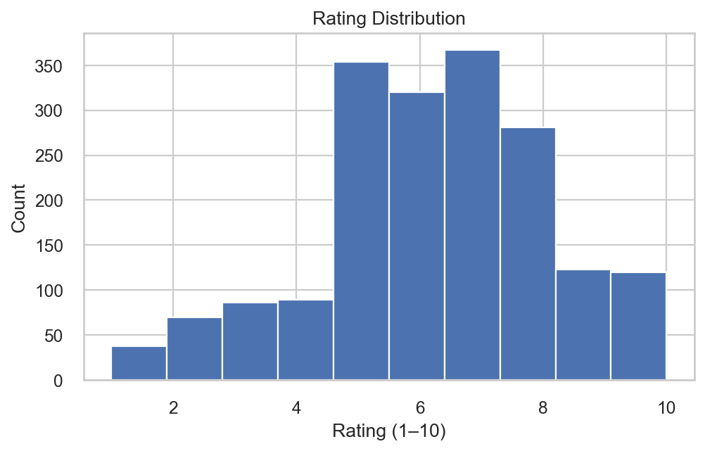
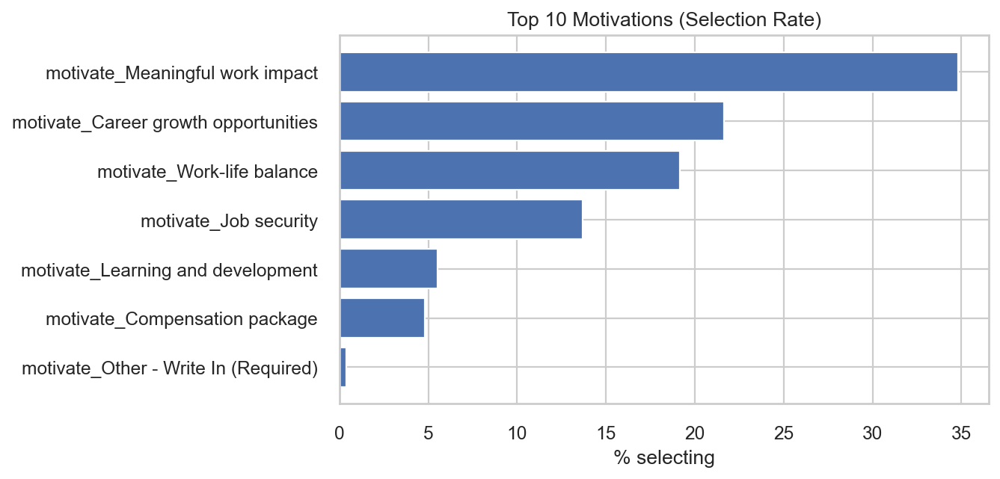
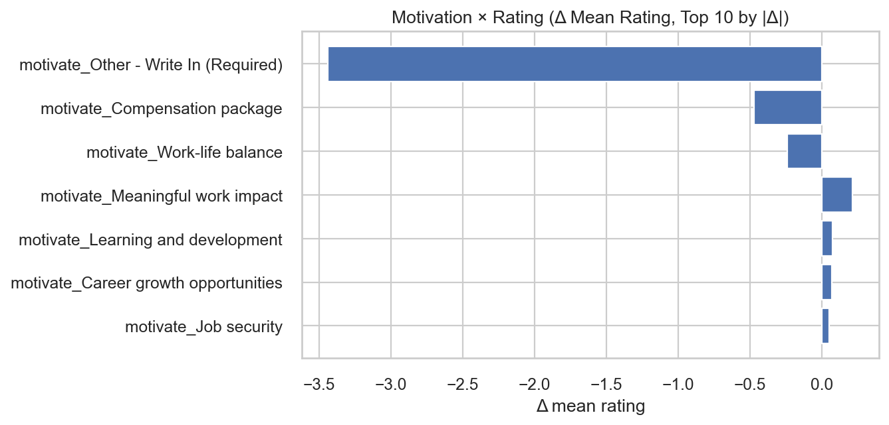
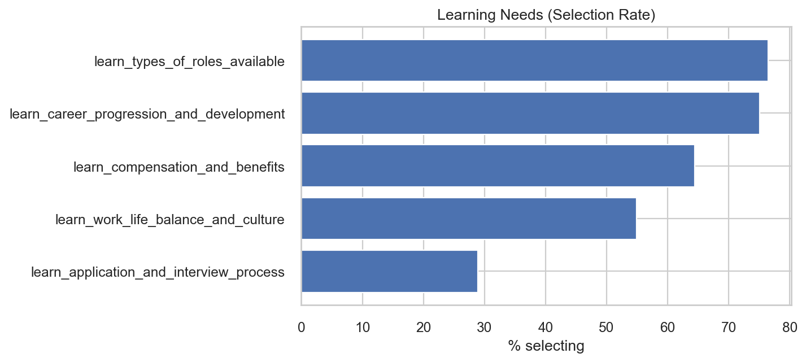
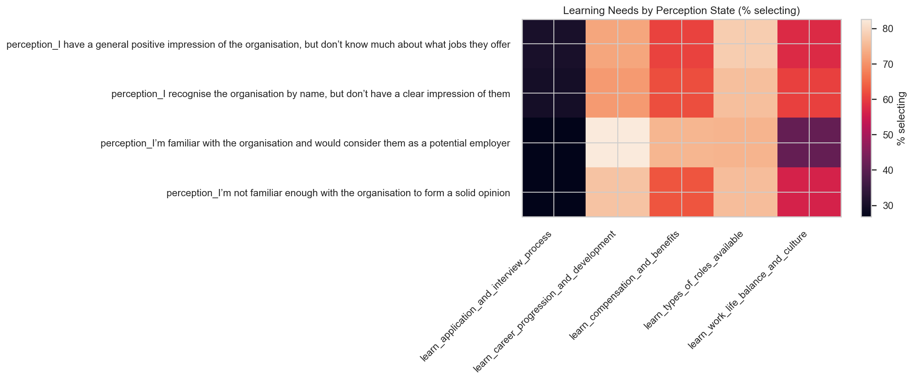
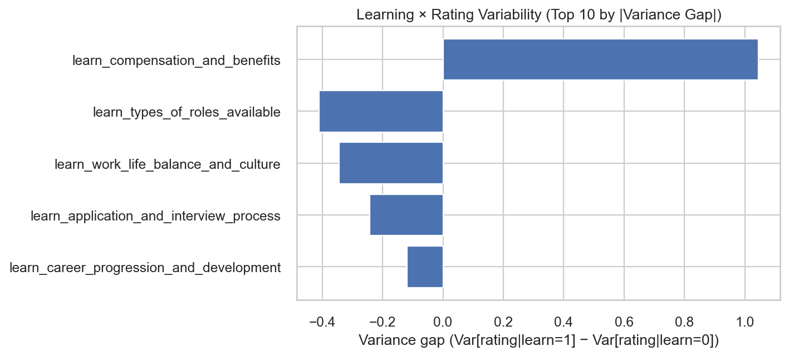
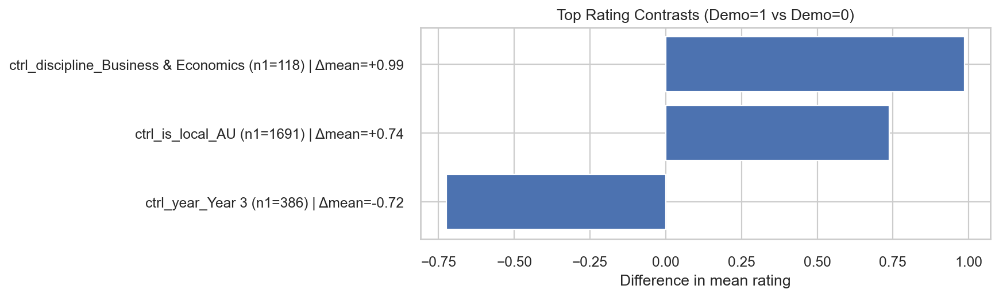

# Employer Attractiveness — Insight Pack

_Auto-generated from notebook run. Timestamp: 2026-02-05 12:17:12_

---

## Part A — Rating Landscape

### Key statistics

- Valid ratings (n): 1848
- Mean rating: 6.28
- Median rating: 6.00
- IQR: 3.00

*Figure: Distribution of employer attractiveness ratings.*

## Part B — Motivation Popularity & Diagnostics

**Table: Top motivations by selection rate.**

- Saved table: `tables/B1_motivation_popularity_top10.csv`

*Figure: Motivation popularity (top 10).*

### Dominance summary

- Top motivation selection rate: 34.8%
- Median motivation selection rate: 13.7%
- Top 3 cumulative selection (not mutually exclusive): 75.6%

**Table: Motivations ranked by delta mean rating (selectors − non-selectors).**

- Saved table: `tables/B3_motivation_delta_mean_rating_top10.csv`

*Figure: Rating differences by motivation (selectors vs non-selectors).*

## Part C — Learning Needs & Uncertainty

**Table: Learning topics by selection rate.**

- Saved table: `tables/C1_learning_popularity_all.csv`

*Figure: Popularity of learning needs (learn_*).*

### Dispersion summary

- Max learn_* selection rate: 76.5%
- Min learn_* selection rate: 28.9%
- Range (max−min): 47.6 pp
- Std. dev across learn_*: 19.4 pp

*Figure: Learning needs segmented by perception state.*

**Table: Variance gap in ratings (learn=1 minus learn=0).**

- Saved table: `tables/C4_learning_rating_variance_gap_all.csv`

*Figure: Topics where learning need coincides with higher/lower rating dispersion.*

## Part D — Demographic Contrasts in Motivation & Learning (Binary vs Rest)

**Table: All binary-vs-rest motivation contrasts (full exploration).**

- Saved table: `tables/D_explore_all_motivation_contrasts.csv`

**Table: All binary-vs-rest learning contrasts (full exploration).**

- Saved table: `tables/D_explore_all_learning_contrasts.csv`

### Method and reporting rules

- Exploration: evaluated all eligible ctrl_* binary demographic flags (min 100 per side).
- Reporting filter: show top 5 contrasts with abs diff ≥ 12 percentage points (pp).
- Rare outcome guard: skip features with < 10 total selections.

No demographic contrasts passed the reporting thresholds (this can occur if differences are small or groups are too imbalanced).

## Part E — Demographic Contrasts in Ratings (Binary vs Rest)

**Table: All binary-vs-rest rating contrasts (full exploration).**

- Saved table: `tables/E_explore_all_rating_contrasts.csv`

### Method and reporting rules

- Exploration: evaluated all eligible ctrl_* binary demographic flags (min 50 per side).
- Reporting filter: show top 5 demographics with abs mean rating diff ≥ 0.7.

**Table: Top binary-vs-rest demographic contrasts in mean ratings (reported).**

- Saved table: `tables/E_report_top_rating_contrasts.csv`

*Figure: Largest mean-rating gaps for binary demographics (1 vs 0).*

### Key reported rating contrasts

- ctrl_discipline_Business & Economics respondents rate the organisation 0.99 points higher on average (demo=1 mean=7.20, demo=0 mean=6.22).
- ctrl_is_local_AU respondents rate the organisation 0.74 points higher on average (demo=1 mean=6.34, demo=0 mean=5.61).
- ctrl_year_Year 3 respondents rate the organisation 0.72 points lower on average (demo=1 mean=5.71, demo=0 mean=6.43).

